# Lo-fi room homepage mockups

Static visual exploration for the personal website homepage. These images are concept art only; no website functionality is included on this branch.

## Warm golden hour

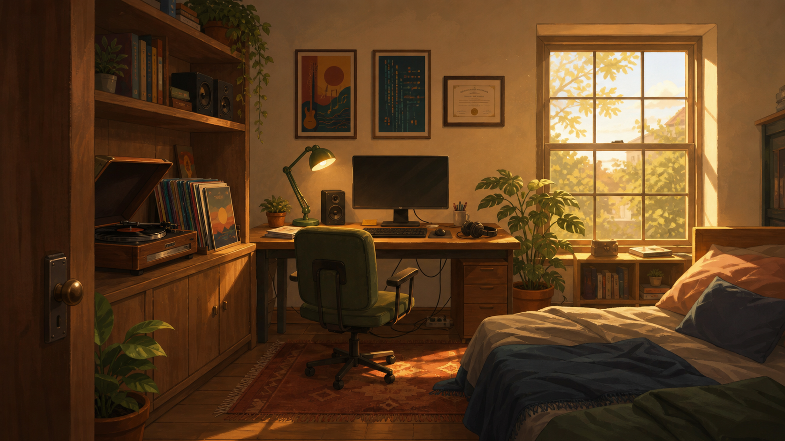

## Rainy night

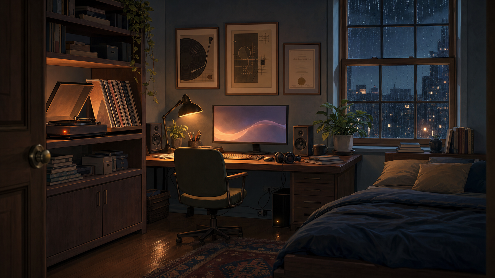

## Rainy night — anime repaint v2

This refinement preserves the rainy-night composition, moves the left speaker inward for symmetry, and shifts the rendering toward hand-drawn linework, cel shading, and painted anime-background texture.

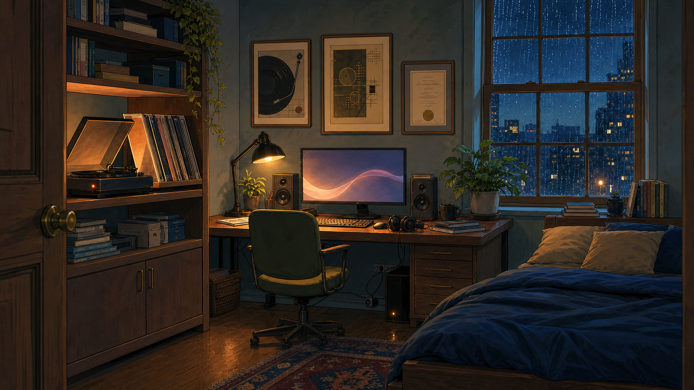

## Rainy night — anime repaint v3

This refinement gives the records a physically supported metal A-frame holder, simplifies the under-desk wiring, enlarges the desktop PC tower, and pushes the entire scene farther toward graphic hand-drawn anime rendering.

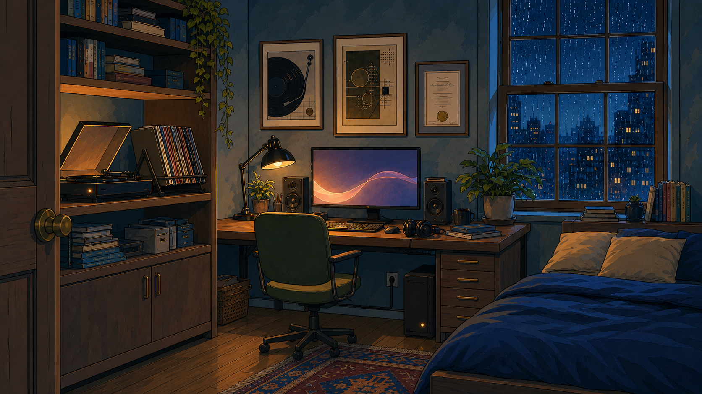

## Rainy night — anime repaint v4

This refinement balances the lower cabinet doors, replaces the lower-shelf clutter with four comic-themed chibi collectibles, corrects the vinyl sleeves into rigid square planes, and commits more strongly to bold outlines and flat anime cel shading.

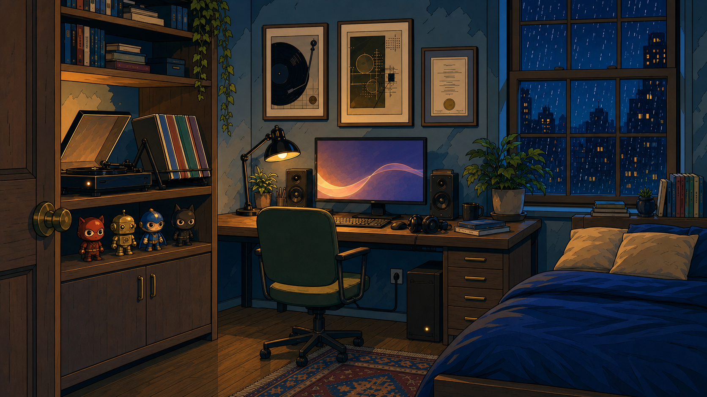

## Rainy night — anime repaint v5

This refinement cleans the walls, replaces the headboard clutter with one digital alarm clock, removes the headphone cable, fills the second-highest shelf with coordinated book series, and turns the vinyl holder into a dense, geometrically consistent wall of colorful LP sleeves.

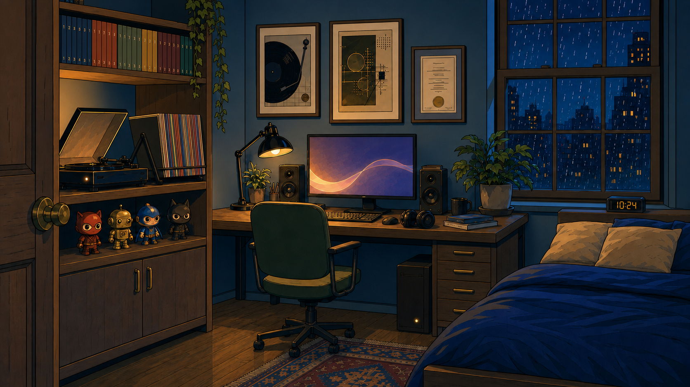

## Rainy night — anime repaint v6

This refinement restores the original upper-shelf arrangement and V2 city view, gives the novel shelf a muted blank-spine palette, completes the vinyl sleeves below the retaining rail, and replaces the character collectibles with cherry-blossom bonsai and pale-blue scooter brick builds.

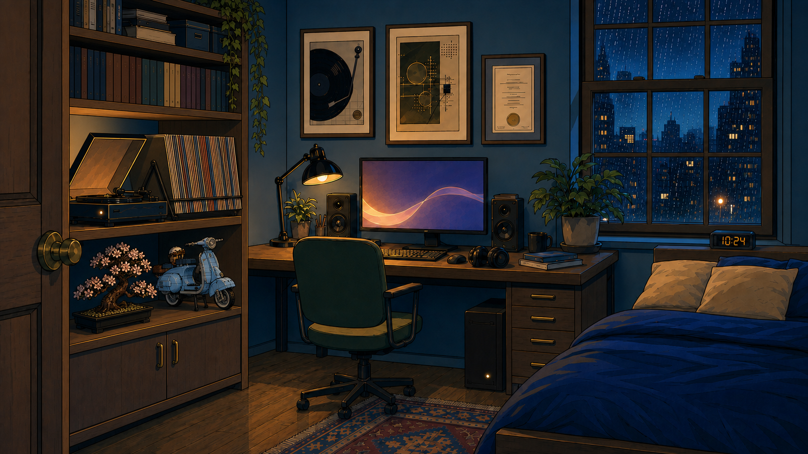

## Rainy night — anime repaint v7

This refinement rebuilds the vinyl storage as a freestanding black metal rack carrying a dense diagonal block of full LP jackets, scales down both brick displays, and rotates the pale-blue scooter into a clean side profile.

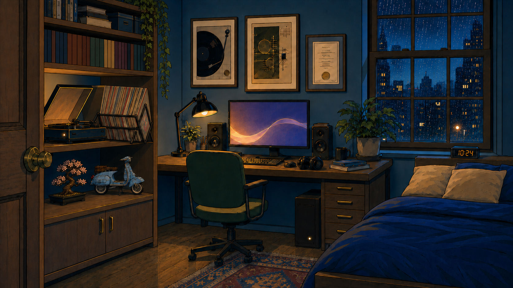

## Rainy night — anime repaint v8

This refinement rotates the vinyl rack into parallel alignment with the turntable, gives its exposed end jacket the supplied crimson pixel-art album cover, and strengthens the bonsai's visible brick seams, studs, plates, and connectors.

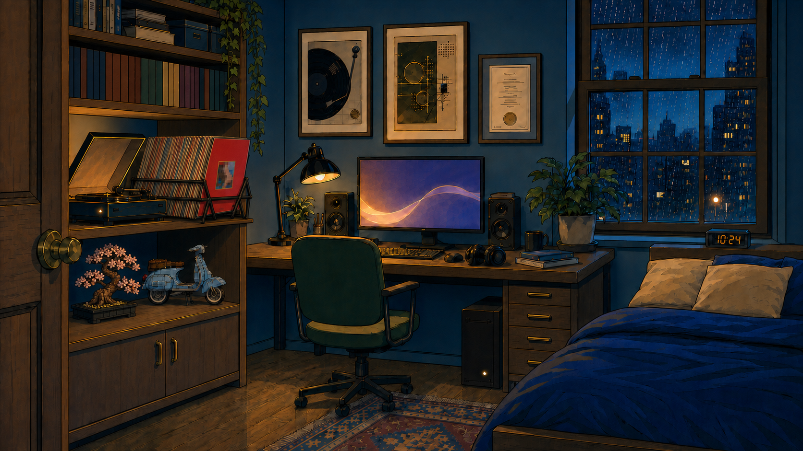

## Rainy night — anime repaint v9

This refinement rotates both the vinyl rack and pale-blue brick scooter 90 degrees counterclockwise in their shelf planes, preserving their construction while presenting new front-to-back orientations.

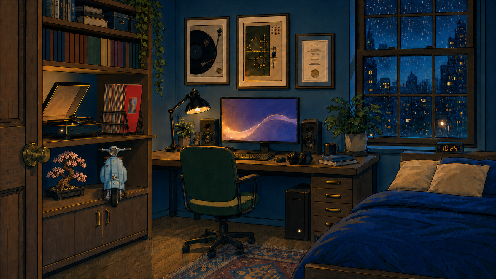

## Rainy night — anime repaint v10

This refinement keeps the vinyl-holder frame fixed while rotating its sleeves to face the record player, then turns the pale-blue brick scooter another 90 degrees into a left-facing side profile.

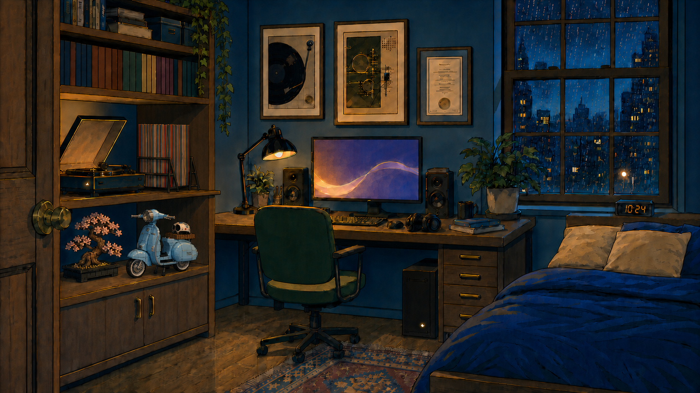

## Rainy night — anime repaint v11

This refinement substantially downsizes and recenters the left-facing brick scooter, then rebuilds the record holder as a straight left-to-right metal frame with its end supports facing the player and shelf wall.

## Rainy night — anime repaint v12

This refinement moves the widened record holder deeper into its shelf cubby and presents the player-facing first sleeve as a clearly visible square album cover, with the remaining records receding behind it.

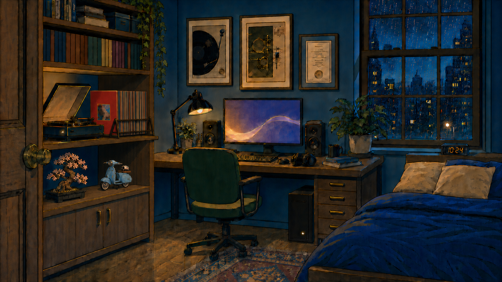

## Rainy night — anime repaint v13

This refinement repairs the protruding record shelf so it sits flush with the shelving unit, downsizes and recesses the player and records, and aligns a low-profile holder with the unchanged first-sleeve orientation while leaving the record edges accessible.

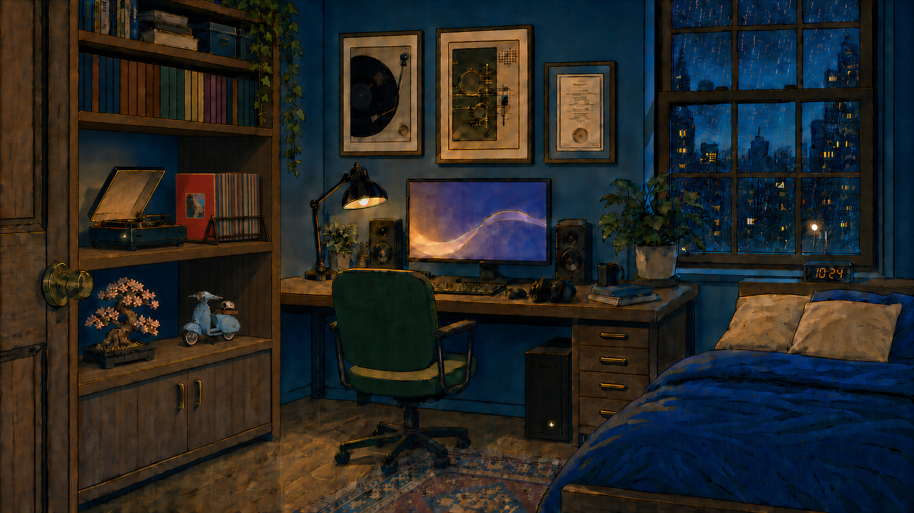

## Rainy night — anime repaint v14

This refinement replaces the complex vinyl holder with a minimal wire rack: one triangular divider holds the first red sleeve, with four matching dividers placed in small browsing gaps between groups of approximately four records.

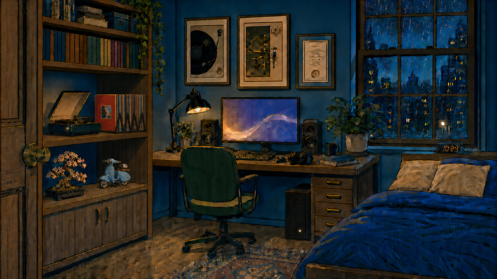

## Rainy night — anime repaint v15

This refinement leaves only the player-side triangle fully visible, buries the internal dividers inside wider browsing gaps between grouped records, and places the final divider outside the far end of the stack.

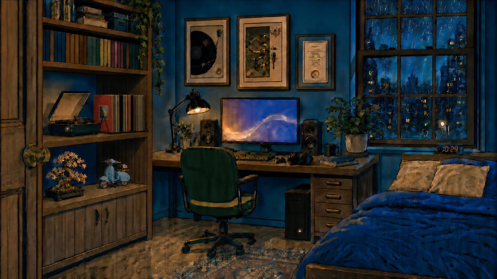

## Rainy night — anime quality rebuild v16

This rebuild restores crisp anime linework, smooth cel-shaded color, and readable LEGO construction details. It also recesses the vinyl stack safely into the shelf and clarifies three softly lit internal divider indents between the lead and end triangles.

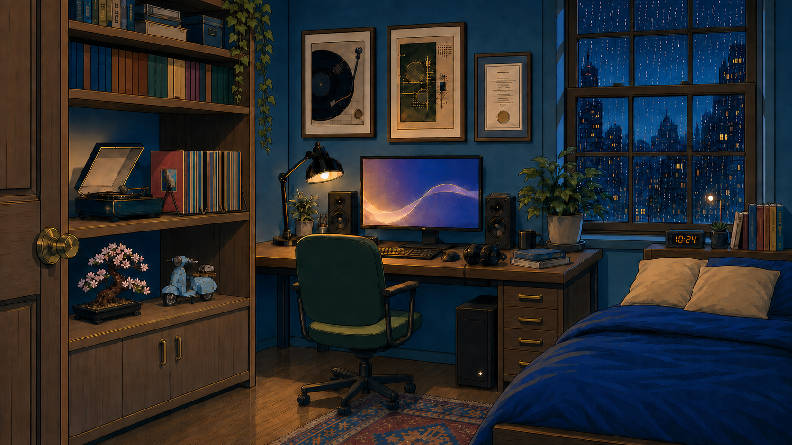

## Rainy night — accessory and rack refinement v17

This refinement removes the headphone cable, rebuilds the keyboard and mouse as coherent wireless accessories, centers the visible album artwork in perspective, and spaces five pronounced rack triangles evenly across four record bays.

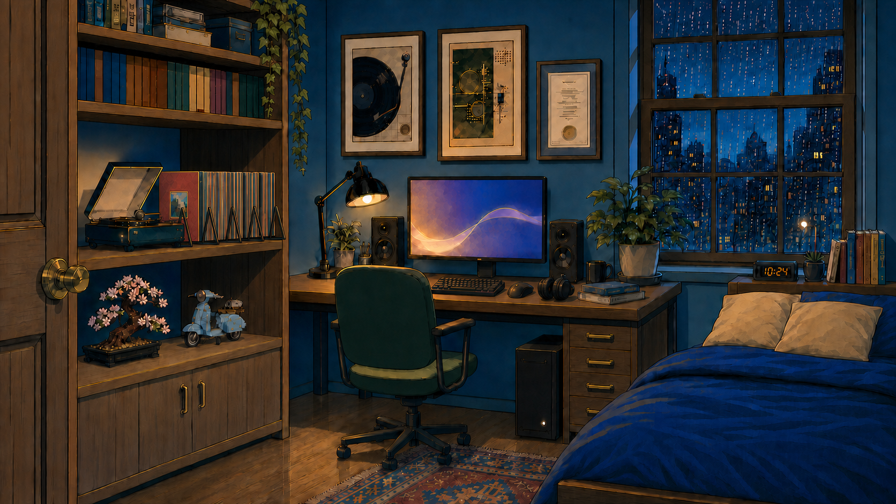

## Rainy night — simplified vinyl rack v18

This refinement returns to V16's simpler holder direction and reduces the vinyl wall into four sparse, evenly separated groups around five readable triangular wire supports.

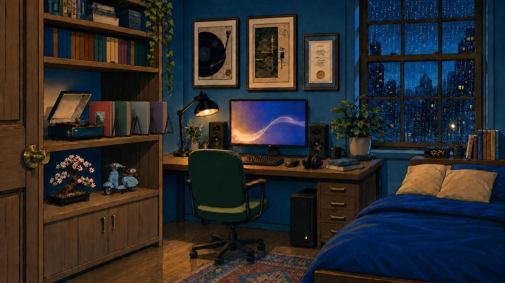

Both directions use the same room structure: record-player shelf on the left, desk and monitor in the center, framed artwork above the desk, window on the right, and bed in the foreground.
